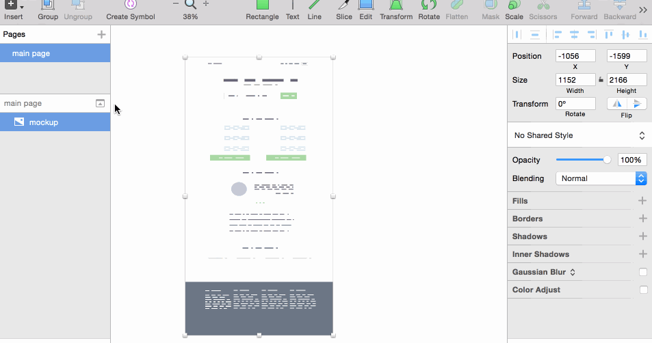
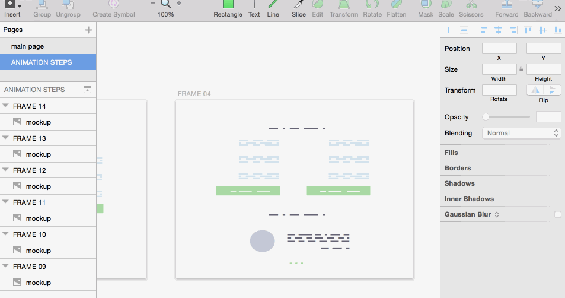
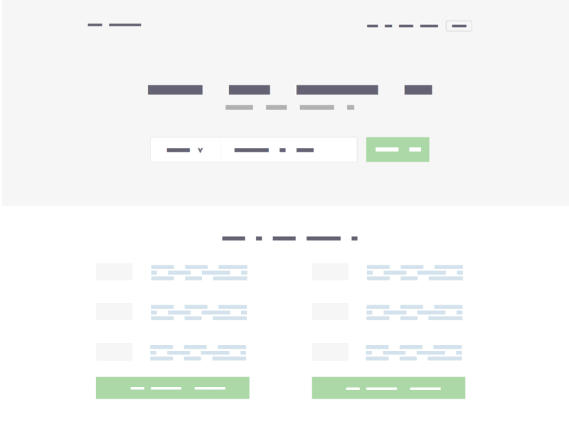

# Frame Sequencer

Sketch plugin that helps you prepare frame sequences to combine with [Generate Gif](https://github.com/nathco/Generate-GIF) plugin to generate animated gifs inside Sketch. Perfect for [Dribbble](https://dribbble.com).

## Instalation
1. Download plugin
2. Navigate the Sketch menu bar to `Plugins ▸ Reveal Plugins Folder...`
3. Place the `Frame sequencer` folder into the revealed plugins directory
4. That's it...

## Usage
1. Select a layer to animate
2. Frame sequencer > Create sequence
3. Enter how many frames you want to get
4. Check 'ANIMATION STEPS' page.
5. We use 'Generate GIF' name sequence so you can use it just like that to create a Gif.

## Perfect for dribbblers
Frame sequencer takes selected layer and scales it to the size of Dribbble canvas (800px x 600px).

## Showcase
###How it works:

###Combine with [Generate Gif](https://github.com/nathco/Generate-GIF) plugin:

### Outcome

##Contact

* Follow [@dawidwu](http://twitter.com/dawidwu) on Twitter
* Email <dawid@plaind.pl>
